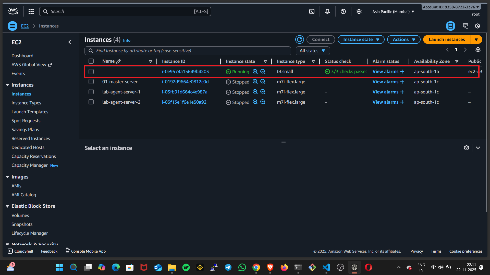
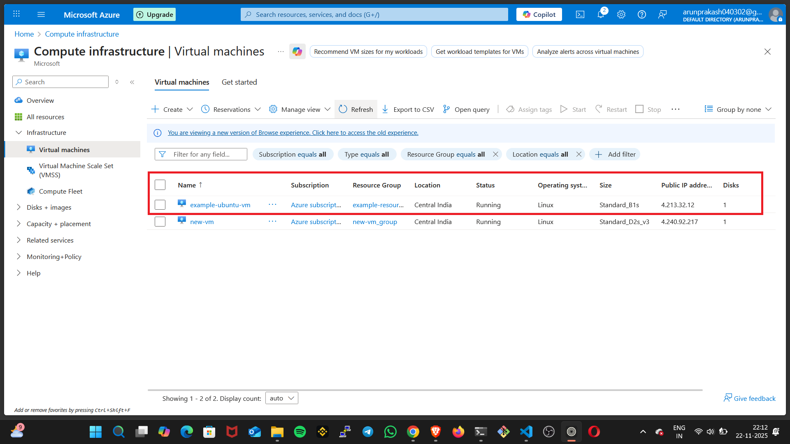
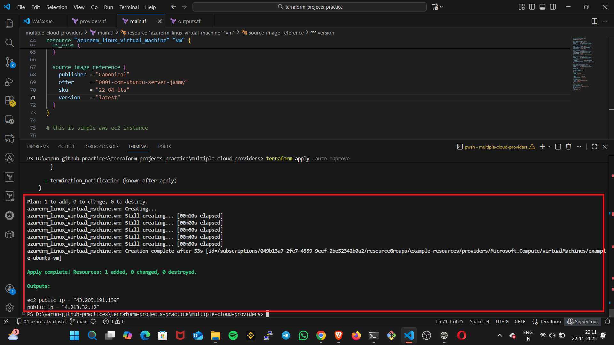

---

```markdown
---

## 🌐 Multi-Cloud Infrastructure with Terraform

Provision resources across multiple cloud providers — such as **AWS EC2** and **Azure Virtual Machines** — using a single unified Infrastructure-as-Code (IaC) workflow powered by **Terraform**.

---
```
## 🚀 Features

- Deploy infrastructure in **multiple cloud platforms**
- Unified configuration manages:
  - 🟧 AWS EC2 Instances
  - 🟦 Azure Virtual Machines
- Fully repeatable and version-controlled deployments
- Single-command lifecycle management (`apply`, `plan`, `destroy`)
```
---
```
## 📁 Project Structure
```
```

.
├── main.tf        # Cloud providers + resources
├── variables.tf   # (Optional) Customizable inputs
├── outputs.tf     # (Optional) Deployment outputs
└── README.md

````

---
```
## 🔧 Requirements

| Tool | Version | Description |
|------|---------|-------------|
| Terraform | ≥ 1.0 | Required IaC tool |
| AWS CLI | Optional | Used for AWS authentication |
| Azure CLI | Optional | Used for Azure login |
```
---

## 🛠 Setup & Usage

### 1️⃣ Install Required Tools

Verify Terraform is installed:

```bash
terraform -version
````

(Optional) Install and configure cloud CLI tools:

```bash
aws configure
az login
```

---

### 2️⃣ Initialize Terraform

```bash
terraform init
```

---

### 3️⃣ Preview Infrastructure Changes

```bash
terraform plan
```

---

### 4️⃣ Deploy Multi-Cloud Resources

```bash
terraform apply
```

This will provision resources **across AWS and Azure** in one operation.

---

### 5️⃣ Cleanup Resources

```bash
terraform destroy
```

This removes all infrastructure managed by Terraform.

---

## 📷 Output / Results

### ✅ AWS EC2 Instance Created



### ✅ Azure Virtual Machine Created



### 🏁 Terraform Apply Success Result



---

## 🌍 Architecture Diagram

```
                +------------------+
                |   Terraform IaC   |
                |  (Single Control) |
                +--------+----------+
                         |
        ┌────────────────┴───────────────────┐
        |                                    |
+-------v--------+                  +--------v--------+
|     AWS        |                  |     Azure       |
|  EC2 Instance  |                  |  VM + Networking|
+----------------+                  +-----------------+
```

---

## 🤝 Contributing

Contributions are welcome!
If you'd like to improve the configuration or documentation, open a pull request.

---

### ⭐ If this project helped you, please consider giving it a star!

```
```
